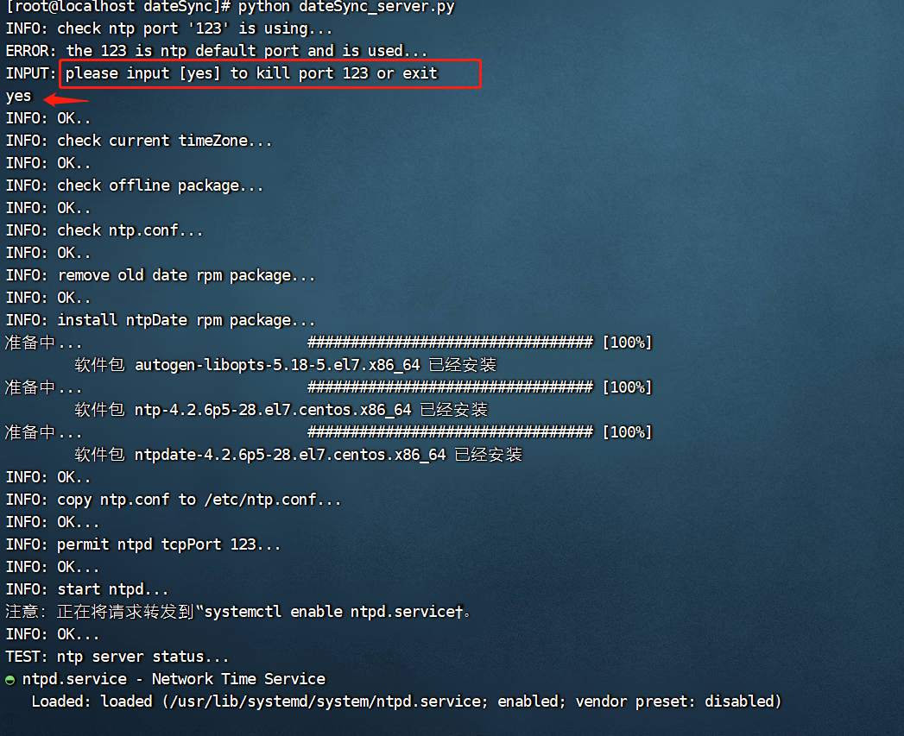
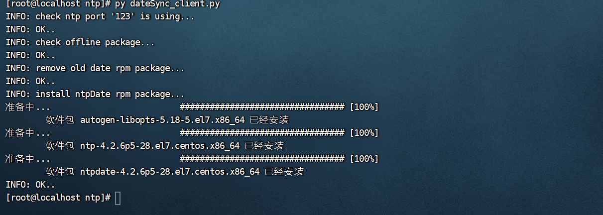
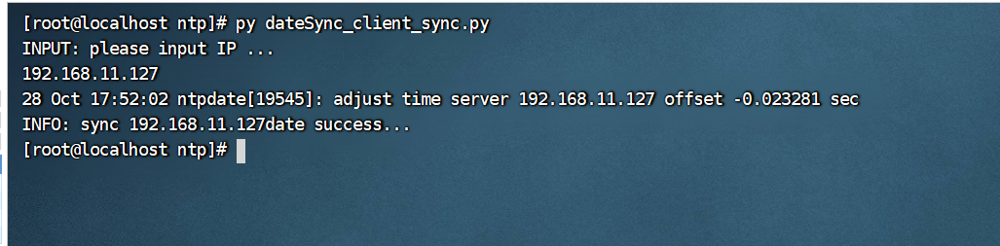
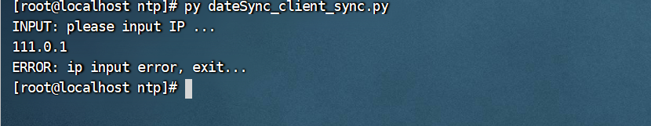

## 服务器时间同步脚本-使用说明

```
createBy lln
createTime 2022-10-28

Server: Centos7 
Python Version: >2.7
```

```
拷贝整个脚本目录至服务器中，根据情况执行下述脚本
```

### 一、服务端（搭建时间服务的设备）

```
执行命令，搭建时间服务器
python dateSync_server.py
```

```
注意事项：
可能出现的异常情况以及脚本执行的前置条件说明
1、服务器时区不对，必须为Oct、国内时区，如果时区不对，脚本不会执行、需要手动调整
2、离线包中的文件不完整（移动过程中离线rpm包丢失或配置文件丢失等）
3、时间服务器固定使用端口123，如端口号被其他程序占用，会在脚本执行过程中提示，可以选择输入【yes】关闭占用端口123的PID,如下图所示
```

执行过程如下图



### 二、客户端（执行同步时间的设备）

```
执行命令，安装时间服务
python dateSync_client.py
```

执行过程如下图



```
执行命令，输入时间服务器IP地址，进行时间同步
python dateSync_client_sync.py
```

```
注意事项：
ip地址输入需要合法，否则程序会给与提示
```

执行过程如下图



